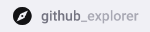

<p align="center">
    <a href="https://github-explorer-ceam.herokuapp.com" target="_blank">
        
     <a/>
</p>

## 🚀 Tecnologias utilizadas

-  [ReactJS](https://reactjs.org/)
-  [Typescript](https://www.npmjs.com/package/@types/react)
-  [Axios](https://github.com/axios/axios)
-  [Polished](https://polished.js.org/)
-  [styled-components](https://www.styled-components.com/)

## 🗂 Como baixar e iniciar o projeto

```bash
# Abra um terminal e copie este repositório com o comando
$ git clone https://github.com/carlos-mattos/github-explorer.git
# ou use a opção de download.

# Entre na pasta github-explorer
$ cd github-explorer

# Instale as dependências
$ npm install

# Inicie o React
$ npm start
```
## 📝 Licença

Este projeto esta sobe a licença MIT. Veja a [LICENÇA](https://opensource.org/licenses/MIT) para saber mais.

Desenvolvido por [Carlos Eduardo](https://www.linkedin.com/in/carlos-eduardo-andrade-de-mattos-a060b1182/) 🤓
